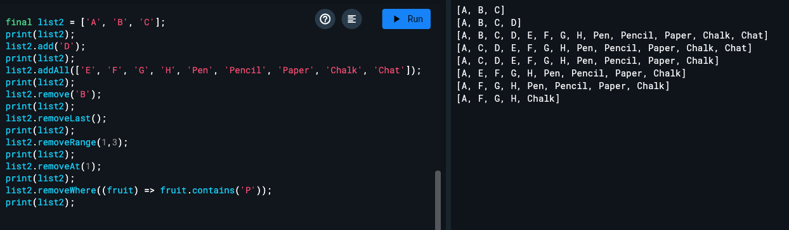

  ## Round a variable

    void main() {
    var a = 1;
    var b = 1 + 1;
    print(a+b);

    var rounded = 2.5.round();
    print(rounded);

    var myString1 =
        'It\'s a cat with age '
        '$a and '
        'height of ${b}';

    var myString2 =
        '''It\'s a cat with age
    $a and
    height of ${b}''';

    print(myString1);
    print(myString2);

    }

  ## Round a variable

    void main() {
    final s1 =
        'String '
        'concatenation'
        " works even over line breaks.";
    var result = s1 == 'String concatenation works even over '
              'line breaks.';
    print(result);

    int? c = null;
    var result2 = b == c;
    print(result2);

### // Declare a variable with a specific type
### // when you don't provide an initial value
    String name;
    name = 'Amena';
    print(name);

### // Declare and initialize a variable
### // at the same time and Dart infers
### // the type
    var username = 'Khatun';
    print(username);
### // Variables can only accept values of their type.
### // username = 5; // Forbidden, as `username` has type `String`.


If you don't provide an initial value or explicit type, Dart infers the variable's type to be the catch-all type dynamic.

Like JavaScript variables, you can assign any value to Dart variables that use the dynamic type.

    // Declare a variable without a type or assigned value and Dart infers the 'dynamic' type
    var age; // Initialize the variable and the type remains `dynamic`
    age = 5;
    age = 'Five'; // Allowed, as `age` has type `dynamic`.
    print(age);

    age = 8;
    print(age);

    age = null;
    print(age);

    age = true;
    print(age);

    const baz = [1, 2, 3];
    const bazForFoo = [4, 5, 6];
    var foo = bazForFoo;
    print(foo);

    foo = baz;
    print(foo);

    int num;
    num = 10;
    const distance = 12;
    const pie = (distance + 5);
    print(num + 2);
    print(pie + 1);
}
  # Null Safety
  ## Nullable vs non-nullable types

    void main() {
        String? returnsNullable() {
            if (2.5.round() > 0.5) {
            return 'Sometimes null';
            } else {
            return null;
            }
        }

        print(returnsNullable());

        String alwaysNotNullable() {
            return 'Always String';
        }

        print(alwaysNotNullable());
    }
  
  ## Null-aware operators
    void main() {
        String? returnsNullable() {
            if (2.5.round() > 0.5) {
            return 'Sometimes null';
            } else {
            return null;
            }
        }

        print(returnsNullable());

        String alwaysNotNullable() {
            return 'Always String';
        }

        print(alwaysNotNullable());
    }

1. Null-coalescing operator (??)
Returns the left-hand value if it’s not null, otherwise returns the right-hand value.
    ```
    String? name;
    String greeting = name ?? "Guest";
    print(greeting); // "Guest" because name is null
    ```
2. Null assignment operator (??=)
Assigns a value to a variable only if it’s currently null.

    ```
    String? username;
    username ??= "DefaultUser";
    print(username); // "DefaultUser"
    If username already had a value, ??= would do nothing.
    ``` 

3. Optional chaining (?.)
Calls a method or accesses a property only if the object is not null.

    ```
        String? text;
        int? length = text?.length; // returns null instead of throwing an error
        Without ?., calling text.length when text is null would throw a runtime error.
    ``` 

4. Null assertion operator (!)
Tells Dart: “I’m sure this value isn’t null”.
Converts a nullable type to a non-nullable type.

    ```
    String? name = "Amena";
    print(name!.length); // OK because we’re sure it's not null
    ⚠️ But if name is null, this throws an error at runtime.
    ```

- In Dart, if a variable is nullable (like String? name), the compiler normally forces you to check for null before using it.

    Example:
    ```
    String? name;
    // print(name.length); // ❌ Compile-time error: name might be null.
    Here the compiler stops you because name could be null, and calling .length on null would crash.
    ```
- When you add !, you’re telling the compiler:

    “I promise this is not null, trust me and don’t complain.”
    ```
    print(name!.length); // Compiler allows it
    ```
    - Compile-time error is suppressed.

    - But if name is actually null at runtime, your app will throw a Null check operator used on a null value error.


    ### Mental model:
    ```
    ?? → “use this default if null”
    ??= → “assign only if null”
    ?. → “safely access property/method if not null”
    ! → “trust me, this isn’t null (I’ll take the risk)”
    ```

    #### Another Example:
    ```
    int? a = 5;
    int b = a; // Not allowed.
    int b = a!; // Allowed. But At runtime, if a turns out to be null, a runtime error occurs.
    ```
    Here’s why:

    int? a = 5;

    a is a nullable int.

    It might hold an int or null.

    int b = a; // ❌ Not allowed

    b is a non-nullable int (it can never hold null).

    Dart doesn’t let you assign a nullable int to a non-nullable int because a might be null.

    This is a compile-time error: “A value of type int? can't be assigned to a variable of type int because int is not nullable.”

    int b = a!; // ✅ Allowed

    ! is the null assertion operator.

    It tells Dart: “I’m sure a is not null here. Trust me.”

    The compiler removes the error, but if a were null at runtime, the app would crash with Null check operator used on a null value.

    Why does Dart enforce this?
    It’s part of Dart’s null safety system:

    Dart wants you to handle all the cases where a value might be null so that your app doesn’t crash unexpectedly.

    ```
    myObject!.someProperty;
    myObject!.someMethod();
    ```

    Yes — this means the ! operator in Dart is the "null assertion operator".

    When you write:

    ```
    myObject!.someProperty;
    myObject!.someMethod();
    you’re telling Dart’s compiler:
    ```

    “I know myObject might be nullable (MyClass?), but I’m 100% sure it’s not null at this point. Please treat it like a non-nullable MyClass and don’t give me compile-time errors.”

    What happens at runtime?
    If myObject is not null → property/method access works normally.

    If myObject is null → your program throws:
    Null check operator used on a null value

    Difference between ?. and !
    ?. → safe access: returns null instead of crashing if myObject is null.

    print(myObject?.someProperty); // returns null if myObject is null
    ! → asserted access: crashes if myObject is null.

    print(myObject!.someProperty); // runtime error if myObject is null

    int multiply(int a, [int b = 5, int? c]) {
    if (c != null) {
      return (a * b * c);
    } else {
      return (a * b);
    }
  }
  
  int result;
  result = multiply(3); print(result);
  
  result = multiply(3, 5);
  print(result);
  
  result = multiply(3, 5, 7);
  print(result);
  
  Here’s a quick table showing var, final, and const in Dart and how they handle reassignment (changing what the variable points to) and mutation (changing the value itself):


  var useNickname;
  final String name;
  // Cannot read name here, not initialized.
  if (useNickname == null) { // Conditions must always be bool
    name = "Bob";
  } else {
    name = "Robert";
  }
  print(name);
  
  ### Note: Conditions must always be bool
  
  var foo = const [9,8,7];
  print(foo); 
  foo = [1,2,3];
  
  foo.add(6);
  foo.remove(1);
  print(foo); 

    - const means the value is fully known and fixed at compile-time (before your program even runs).

    - The compiler can predict the exact value, not just the type.

    const x = 10; // Compiler knows x is exactly 10 forever.

In short:
const means “compiler-time, deeply immutable value.”

var foo = const []: foo can change, but the list is constant.

const baz = []: neither baz nor the list can change.

Classes can have const constructors to create constant objects.

```
    multiplier({isMultiplication, required int a, b, int? c}) {
    
        isMultiplication = 'Testing dynamic type';
        print(isMultiplication);
        isMultiplication = 222;
        print(isMultiplication);
        
        if (c != null && b != null) {
        return (a * b * c);
        } else if (c != null && b == null) {
        return (a * c);
        } else if (c == null && b == null) {
        return a;
        }
    
    }

    print(multiplier(a: 2));
```

# [ ] → optional positional parameters.

# { } → optional named parameters.

# Note: Required named parameters can not have a default value. on the below Example: required int a=5 -> is wrong!
multiplier1({bool? isMultiplication, required int a =5, int? b, required int? c}) {
    if (c != null && b != null) {
      return a * b * c;
    } else if (c != null && b == null) {
      return a * c;
    } else if (c == null && b == null) {
      return a;
    }
  }

  print(multiplier1(a: 2, c: 5));


  multiplier1(bool? isMultiplication, {
    required int a,
    required int? b,
    required int? c,
  }) {
    if (c != null && b != null) {
      return a * b * c;
    } else if (c != null && b == null) {
      return a * c;
    } else if (c == null && b == null) {
      return a;
    }
  }

  print(multiplier1(null, a: 2, b: null, c: null));

  multiplier([bool? isMultiplication, int a = 0, int? b, int? c]) {
    if (c != null && b != null) {
      return a * b * c;
    } else if (c != null && b == null) {
      return a * c;
    } else if (c == null && b == null) {
      return a;
    }
  }

  print(multiplier(null, 2));
}

```
    print(
      [1, 2, 3].map((e) {
        e = e * 2;
        return e + 3;
      }).toList(),
    );
  
  
    print([for (var e in [1,2,3]) (e*2) + 3]);

    // The above two snippets are same.
```

#Genarators
```
Iterable<int> naturalsTo(int n) sync* {
    int k = 0;
    while (k < n) {
      yield k++;
    }
  }

  Iterable<int> doubleNaturalsTo(int n) sync* {
    int k = 0;
    while (k < n) {
      yield* [k, k];
      k++;
    }
  }

  print(naturalsTo(5));
  print(doubleNaturalsTo(5));
  ```

# IN JAVASCRIPT - Quick rule of thumb:
### for...in → keys/indexes
```
const arr = ['a', 'b', 'c'];

for (const key in arr) {
  console.log(key); // 0, 1, 2 (indexes)
}
```
# For objects:
```
const obj = { name: 'Amena', age: 25 };

for (const key in obj) {
  console.log(key, obj[key]); 
  // name Amena
  // age 25
}
```

### for...of → values
```
const arr = ['a', 'b', 'c'];

for (const value of arr) {
  console.log(value); // a, b, c (values)
}
```
## Works on strings too:
```
for (const ch of 'Hi') {
  console.log(ch); // H, i
}
```
# IN DART - Quick rule of thumb:
### Dart’s for-in ≈ JavaScript’s for...of (values).

### Dart doesn’t have a for...in equivalent that iterates keys automatically for objects — you explicitly iterate over .keys or .entries for maps.

### In Dart, there’s no direct distinction like JavaScript’s for...in vs for...of, because Dart has a simpler iteration model:

### For arrays (lists): Dart’s for-in iterates over values, like JavaScript’s for...of:


```
var arr = ['a', 'b', 'c'];

for (var value in arr) {
  print(value); // a, b, c
}
// If you want the index, use a traditional for loop:

for (var i = 0; i < arr.length; i++) {
  print('$i: ${arr[i]}'); // 0:a, 1:b, 2:c
}
```
### For maps: for-in iterates over keys:

```
var map = {'name': 'Amena', 'age': 25};
for (var key in map.keys) {
  print('$key: ${map[key]}');
}

// You can also iterate over key-value pairs:

for (var entry in map.entries) {
  print('${entry.key}: ${entry.value}');
}
```

#Operators in DART
```
  assert(2 == 2);
  assert(2 != 3);
  assert(3 > 2);
  assert(2 < 3);
  assert(3 >= 3);
  assert(2 <= 3);
```

#First Class Function
```
  void printFunction(int a) {
    print('This is: $a');
  }
  var list = [1, 2, 3];
  list.forEach(printFunction);
```
in Dart 'Switch case must have a break, continue, return or throw.'



# In case of LISTs, the position indexes does start count from 0

```

// Initialize list and specify full type
final List<String> list1 = <String>['one', 'two', 'three'];

// Initialize list using shorthand type
final list2 = <String>['one', 'two', 'three'];

// Dart can also infer the type
final list3 = ['one', 'two', 'three'];

final fruits = <String>['apple', 'orange', 'pear'];
final fruit = fruits[1];

final fruits = <String>['apple', 'orange', 'pear'];
fruits.add('peach');
fruits.addAll(['kiwi', 'mango']);

final fruits = <String>['apple', 'orange', 'pear'];
fruits.insert(0, 'peach');
fruits.insertAll(0, ['kiwi', 'mango']);

final fruits = <String>['apple', 'orange', 'pear'];
fruits[2] = 'peach';

  final list2 = ['A', 'B', 'C'];
  print(list2);  
  list2.add('D');
  print(list2); 
  list2.addAll(['E', 'F', 'G', 'H', 'Pen', 'Pencil', 'Paper', 'Chalk', 'Chat']);
  print(list2);
  list2.remove('B');
  print(list2);
  list2.removeLast();
  print(list2);
  list2.removeRange(1,3); // Here the position indexes does start count from 0
  print(list2);
  list2.removeAt(1);
  print(list2);
  list2.removeWhere((fruit) => fruit.contains('P'));
  print(list2);
```


# Use length to obtain the number of values in the List:
```


    final list2 = ['A', 'B', 'C'];
    print(list2.length);

    print(list2.isEmpty);
    print(list2.isNotEmpty);

    final list1 = List.filled(3, 'a', growable: true);
    print(list1);
    list1.add('van');
    print(list1);

  final list4 = List.generate(3, (index) => 'a${index + 4}');
  print(list4);
  list4.add('test');
  print(list4);
  ```
# Array of JS is List in DART


## Futures in DART:
```
  String str = 'Some String';
  Future<String> futureString = Future<String>.value(str);
  print(futureString);

  Future<String> fetchString() async {
    return 'Some String';
  }

  Future<void> asyncFunction() async {
    String str2 = await fetchString();
    print(str2);
  }

  Future<String> futureFunc() async {
    return 'Hi!';
  }

  Future<String> httpResponseBody = futureFunc();

  httpResponseBody.then((String value) {
    print('Future resolved to a value: ${value}');
  });

  futureFunc()
    .then((String value) {
      print('Future resolved to a value2: ${value}');
    })
    .catchError((err) => {
      print(
      'Future encountered a error before resolving!'
      )
    });

```

# Dart does not allow mixing optional positional [ ] and named { } parameters in the same parameter list.

## You can have:

* Only positional (required + [optional])

* or required positional + named ({optional named}),
but not both [ ] and { } together.

```

void main() {
  Point2 p1 = Point2(3.5, 3.6, multiply: false);
  Point2 p2 = Point2(3.5, 3.6, multiply: true);
  Point2 p3 = Point2(3.5, 3.6);

  Point p4 = Point(2, multiply: true);

  Point3 p5 = Point3(2, y: 3, multiply: true);

  print(p1.multiply);
  print(p2.multiply);
  print(p3.multiply);

  print('----------');
  print(p4.multiply);

  print('----------');
  print(p5.multiply);
}

class Point2 {
  final double x;
  final double y;
  final bool? multiply;

  //   Point(double x, double y) : this.x = x, this.y = y { }
  //   Point(this.x, this.y);

  //   Point(this.x, [this.y = 5]);
  //   Point({required this.x, this.y = 5});
  //   Point(this.x, this.y, {this.multiply});
  //   Point(this.x, this.y, {this.multiply = false});

  Point2(this.x, this.y, {this.multiply});
}

class Point {
  final double x; // required positional
  // final double y;         // optional positional
  final bool? multiply; // optional named

  Point(this.x, {this.multiply});
}

class Point3 {
  final double x; // required positional
  final double y; // required named
  final bool? multiply; // optional named

  Point3(this.x, {required this.y, this.multiply});
}


```
