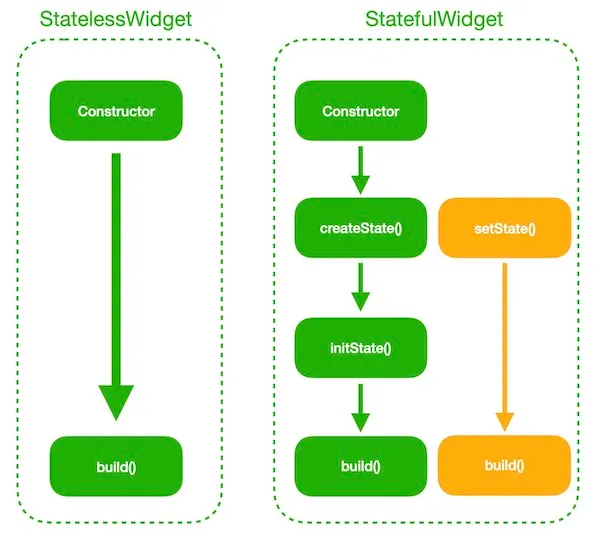

There are two types of widgets in Flutter.

Stateless Widgets.
Stateful Widgets.
=> Stateless Widgets do not contain states hence they can be updated only when its parent changes. Once created, stateless widgets cannot be updated means they are immutable, they have to be created again by supplying new data in order to see the changes.

``
import 'package:flutter/material.dart';
void main() => runApp(MyApp());
class MyApp extends StatelessWidget {
    @override
    Widget build(BuildContext context) {
        return Container();
    }
}
``
=> Stateful Widgets can hold the states internally, so it can be updated whenever its states changes and also whenever its parent changes. It is mutable widget, so it can be drawn multiple times in its lifetime.

``
import 'package:flutter/material.dart';
void main() => runApp(MyApp());
class MyApp extends StatefulWidget {
    @override
    _MyAppState createState() => _MyAppState();
}
//
class _MyAppState extends State<MyApp> {
    @override
    Widget build(BuildContext context) {
        return Container();
    }
}
``

