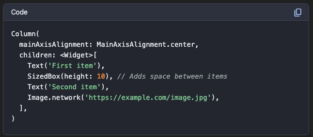
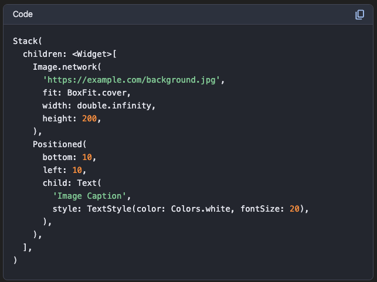

In Flutter, the choice between a Stack and a Column widget depends on the desired layout and arrangement of child widgets.
Use a Column when:
## You need to arrange widgets vertically in a linear sequence. This is the primary purpose of a Column. Examples include a list of items, form fields stacked on top of each other, or a series of text paragraphs.
## Widgets do not need to overlap. A Column arranges its children one after another, without any overlapping.
## You need to control the vertical alignment and spacing between children. Column provides properties like mainAxisAlignment (for vertical alignment) and crossAxisAlignment (for horizontal alignment within the column).
Example of Column usage:

``Column(
mainAxisAlignment: MainAxisAlignment.center,
children: <Widget>[
Text('First item'),
SizedBox(height: 10), // Adds space between items
Text('Second item'),
Image.network('https://example.com/image.jpg'),
],
)``

Use a Stack when:
## You need to layer widgets on top of each other. This is the defining characteristic of a Stack. It allows for overlapping elements, such as text over an image, a loading spinner on top of content, or a button overlaid on a map.
## You need precise positioning of children within the stack. Stack children can be wrapped in Positioned widgets to control their exact placement relative to the stack's edges (top, bottom, left, right).
## You are creating complex UI elements with overlapping components. This often involves combining multiple widgets to achieve a specific visual effect.
Example of Stack usage:

``Stack(
children: <Widget>[
Image.network(
'https://example.com/background.jpg',
fit: BoxFit.cover,
width: double.infinity,
height: 200,
),
Positioned(
bottom: 10,
left: 10,
child: Text(
'Image Caption',
style: TextStyle(color: Colors.white, fontSize: 20),
),
),
],
)``

In summary:
Column for linear vertical arrangements without overlap.
Stack for layering and precise positioning of overlapping widgets.