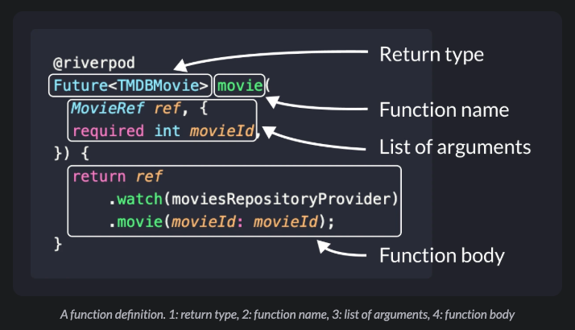
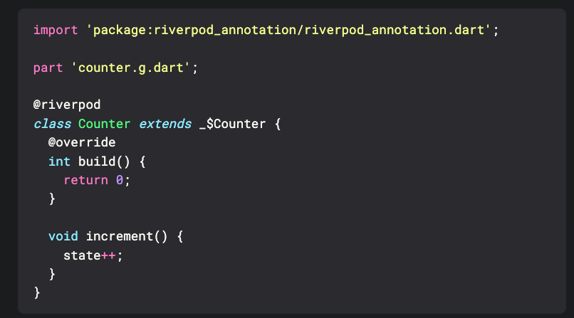
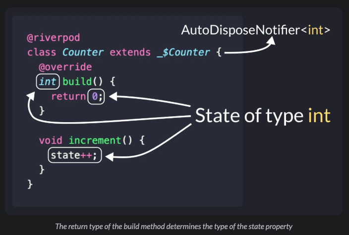
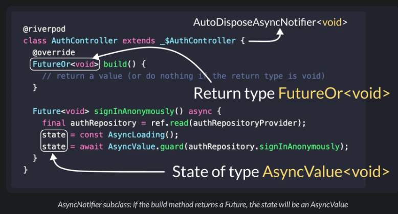

``final counterProvider = StateProvider<int>((ref) {
    return 0;
});
//
final authControllerProvider = StateNotifierProvider<
    AuthController, AsyncValue<void>>((ref) {
    return AuthController(ref);
});
``

``
import 'package:riverpod_annotation/riverpod_annotation.dart';
part 'counter.g.dart';
@riverpod
class Counter extends _$Counter {
    @override
    int build() {
        return 0;
    }
    void increment() {
        state++;
    }
}
// counterProvider will be generated by build_runner
////////
class AuthController extends StateNotifier<AsyncValue<void>> {
    AuthController(this.ref)
    // set the initial state (synchronously)
    : super(const AsyncData(null));
    final Ref ref;
    //
    Future<void> signInAnonymously() async {
        // read the repository using ref
        final authRepository = ref.read(authRepositoryProvider);
        // set the loading state
        state = const AsyncLoading();
        // sign in and update the state (data or error)
        state = await AsyncValue.guard(authRepository.signInAnonymously);
    }
}
``

Since AsyncNotifier supports asynchronous initialization, we can write code like this:

@riverpod
class SomeOtherController extends _$SomeOtherController {
@override
// note the [Future] return type and the async keyword
Future<String> build() async {
final someString = await someFutureThatReturnsAString();
return anotherFutureThatReturnsAString(someString);
}

// other methods here
}
In this case, the build method is truly asynchronous and will only return when the future completes.

But the build method of any listener widgets needs to return synchronously and can't wait for the future to complete:

class SomeWidget extends ConsumerWidget {
@override
Widget build(BuildContext context, WidgetRef ref) {
// returns AsyncLoading on first load,
// rebuilds with the new value when the initialization is complete
final valueAsync = ref.watch(someOtherControllerProvider);
return valueAsync.when(...);
}
}

